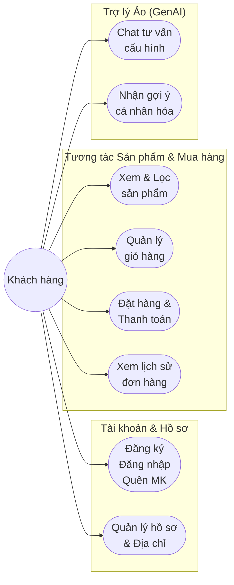
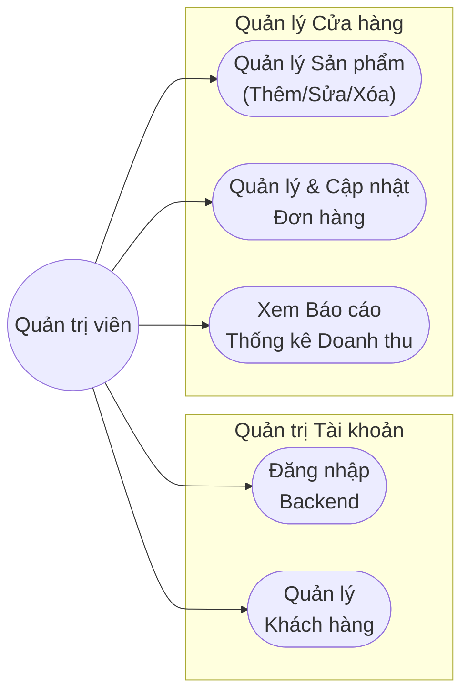
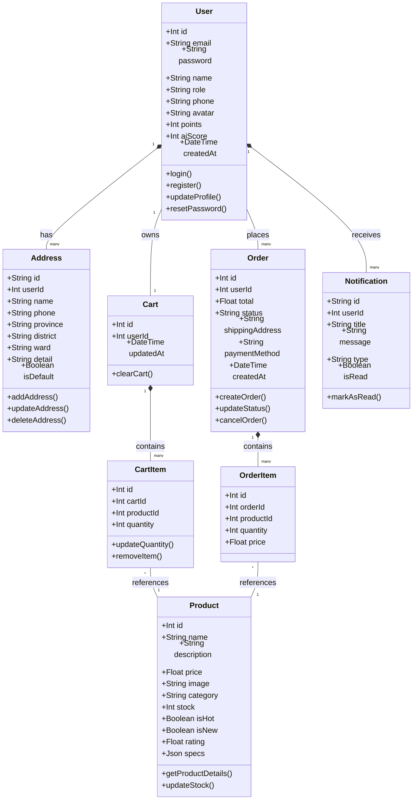
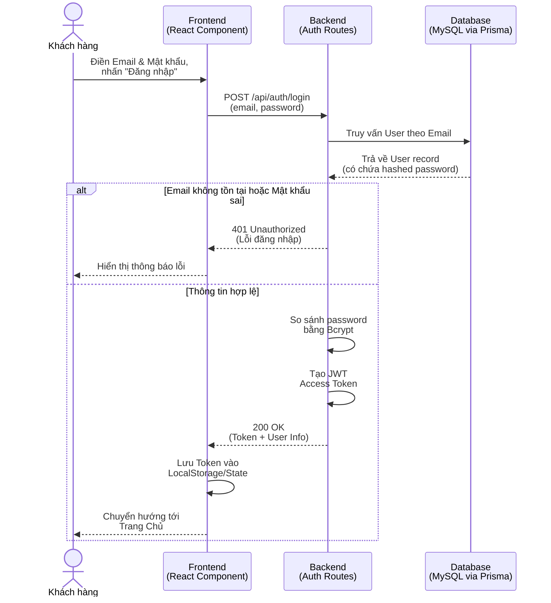
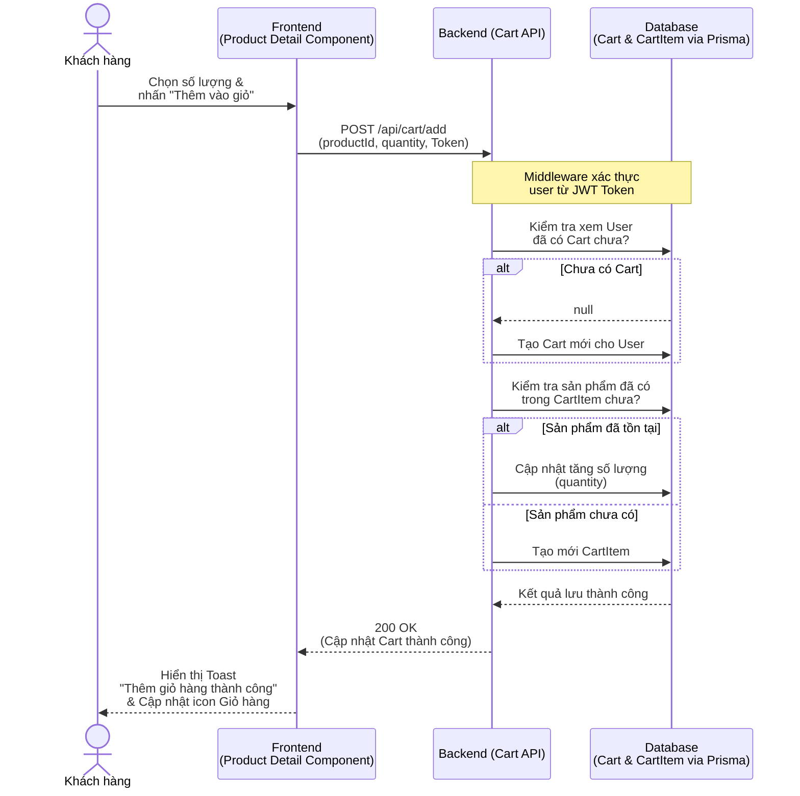
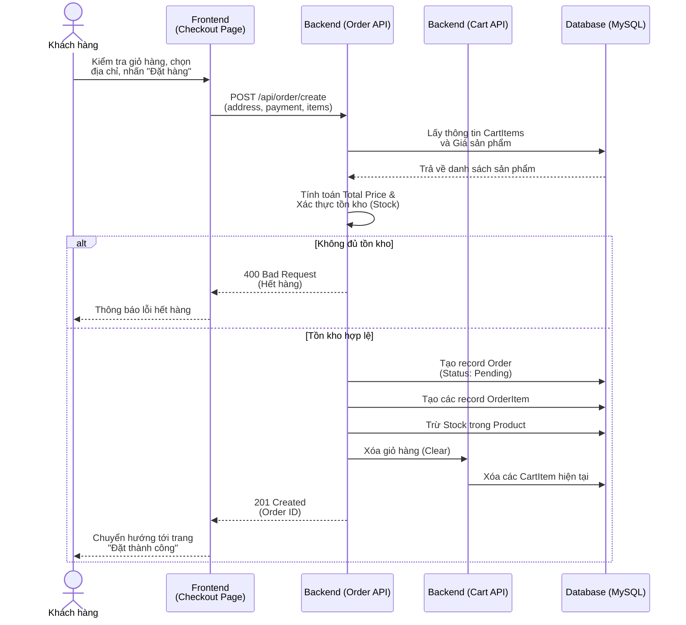
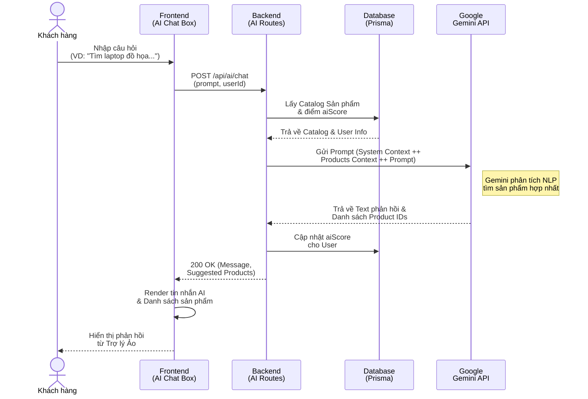
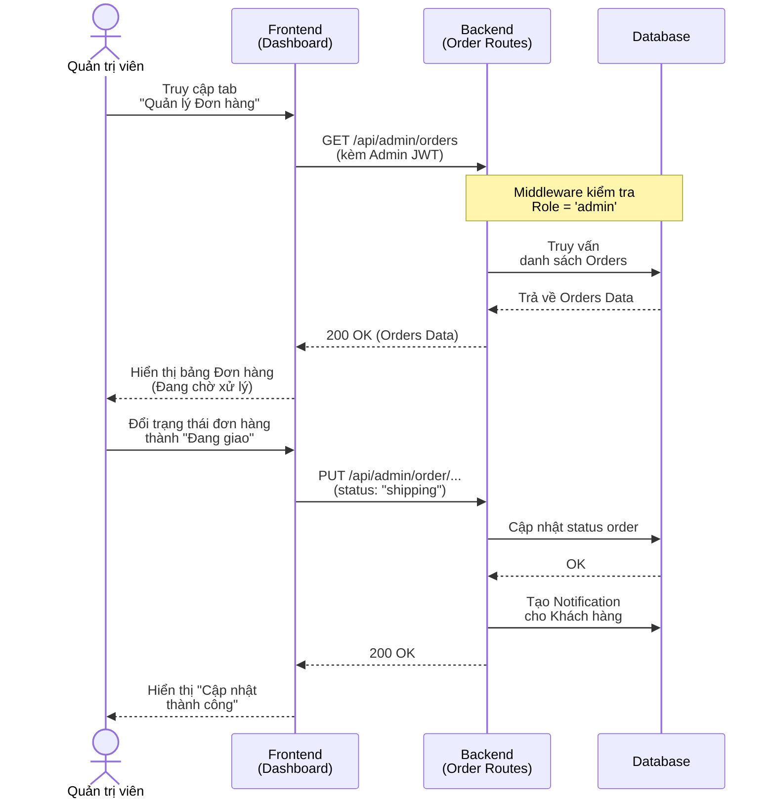

# Các Mẫu Sơ Đồ Hệ Thống TechStore AI (Mermaid)

Hướng dẫn: Copy các khối mã (code block) dưới đây và dán vào [Mermaid Live Editor](https://mermaid.live/) để tạo sơ đồ.

---

## 1. Mô hình Use-case (Chia nhỏ để vừa khổ giấy A4)

*Do hệ thống có nhiều chức năng, việc gom tất cả vào 1 sơ đồ sẽ làm hình ảnh bị kéo giãn, chữ rất nhỏ khi chèn vào Word. Vì vậy, sơ đồ được chia làm 2 phần chính:*

### 1.1 Sơ đồ Use-case của Khách hàng
*(Tập trung vào trải nghiệm mua sắm và trợ lý AI)*

### 1.2 Sơ đồ Use-case của Quản trị viên (Admin)
*(Tập trung vào nghiệp vụ quản lý hệ thống bán hàng)*

---

## 2. Mô hình Lớp và Đối tượng (Class Diagram)

---

## 3. Các Biểu Đồ Tuần Tự (Sequence Diagrams)

### 3.1 Quy trình Đăng nhập và Xác thực (Authentication)

### 3.2 Quy trình Thêm sản phẩm vào Giỏ hàng

### 3.3 Quy trình Đặt hàng (Checkout)

### 3.4 Quy trình Trợ lý Ảo AI tư vấn (Google Gemini)

### 3.5 Quy trình Quản trị viên xử lý đơn hàng (Admin)

